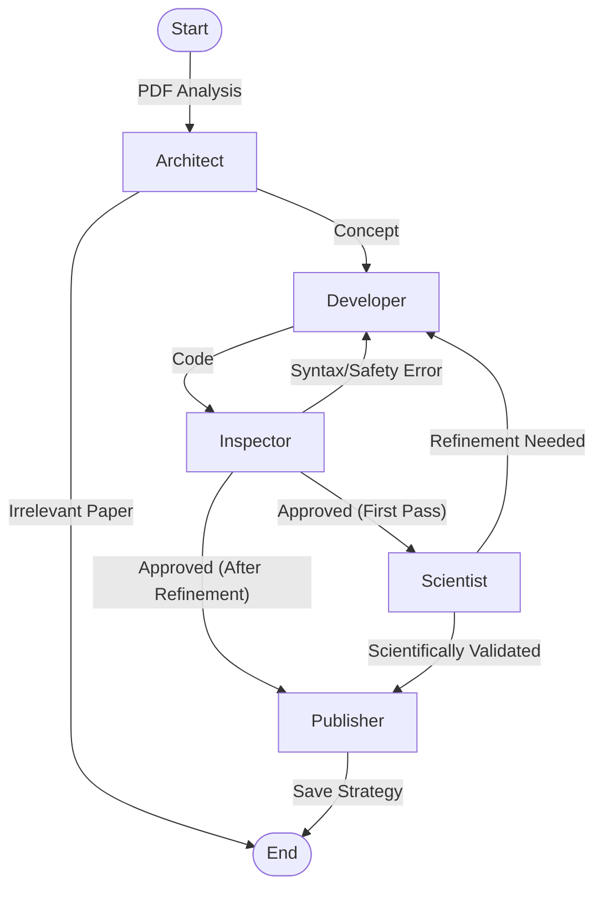

    ___    __      __            ______            __                  
   /   |  / /___  / /_  ____ _  / ____/___ ______/ /_____  _______  __
  / /| | / / __ \/ __ \/ __ `/ / /_  / __ `/ ___/ __/ __ \/ ___/ / / /
 / ___ |/ / /_/ / / / / /_/ / / __/ / /_/ / /__/ /_/ /_/ / /  / /_/ / 
/_/  |_/_/ .___/_/ /_/\__,_/ /_/    \__,_/\___/\__/\____/_/   \__, /  
        /_/                                                  /____/   

> **Turns Academic Papers into Trading Algorithms.**

[](https://www.python.org/downloads/)
[](https://github.com/langchain-ai/langgraph)
[](https://www.quantconnect.com/)
[](https://opensource.org/licenses/MIT)

---

**AlphaFactory** is an autonomous AI agent system designed to read academic financial research papers (PDFs), understand the trading strategies described within, and generate valid, backtestable **QuantConnect (LEAN)** algorithms.

It uses a sophisticated graph of specialized agents to ensure quality:
- 🧠 **Architect**: Extracts strategy concepts and logic.
- 👨‍💻 **Developer**: Writes production-grade Python code.
- 🕵️ **Inspector**: Performs static analysis, safety checks, and prevents logical errors (C# translation bugs, look-ahead bias, etc.).
- 🔬 **Scientist**: Reviews the code against the original paper to ensure scientific accuracy.

## 🚀 Key Features

*   **Paper-to-Code**: Native PDF parsing of financial papers to extract trading logic.
*   **QuantConnect Compatible**: Generates Python scripts ready for backtesting on the [QuantConnect](https://www.quantconnect.com) platform.
*   **Scientific Peer Review**: Dedicated agent layer to verify the code matches the paper's intent.
*   **Self-Healing**: Cycles between Developer and Inspector to fix syntax and architectural errors automatically.
*   **Safety First**: Built-in AST analysis prevents common quantitative errors (e.g. iterating MultiIndex tuples, using future data).
*   **Cross-Platform**: Works on Windows, Linux, and macOS.

## 🔬 Purpose

This project is designed to bridge the gap between **Academic Research** and **Implementation**. It accelerates the workflow of converting theoretical trading ideas into executable code for testing and validation.

**Note**: This tool is strictly for **Research Purposes Only**. It is intended to help researchers and developers prototype ideas quickly, not to run unsupervised live trading.

## 🛠️ Architecture

The system is built on **LangGraph**. Steps flow as follows:



## � Best Practices

*   **Model Recommendation**: For complex logic extraction, flagship models (e.g., **GPT-5.2**, **Gemini 3**) are strongly recommended. Smaller models may struggle with nuaced financial terminology.
*   **Manual Review**: While AlphaFactory strives for production-grade code, financial algorithms are complex. Always review the generated code for edge cases and parameter logic before backtesting. Manual adjustments may be required.

## �📦 Installation

1.  **Clone the Repository**
    ```bash
    git clone https://github.com/yourusername/AlphaFactory.git
    cd AlphaFactory
    ```

2.  **Install Dependencies**
    ```bash
    pip install -r requirements.txt
    ```

3.  **Configure Environment**
    Copy the example environment file and add your API keys (OpenAI, DeepSeek, or Google Gemini).
    ```bash
    cp .env.example .env
    # Edit .env with your keys
    ```

## 🖥️ Usage

Run the agent by providing a PDF file.

```bash
# Basic Usage (Reads from ./pdf/ folder)
python main.py --paper "Jegadeesh_Titman_1993.pdf"

# Advanced Usage (Custom input and output paths)
python main.py --paper "~/Downloads/Crypto_Momentum.pdf" --saveto "~/Desktop/MyAlgo.py"
```

## 🤝 Contributing

Contributions are welcome! Please feel free to submit a Pull Request.

1.  Fork the Project
2.  Create your Feature Branch (`git checkout -b feature/AmazingFeature`)
3.  Commit your Changes (`git commit -m 'Add some AmazingFeature'`)
4.  Push to the Branch (`git push origin feature/AmazingFeature`)
5.  Open a Pull Request

## 📄 License

Distributed under the MIT License. See `LICENSE` for more information.

---
*Disclaimer: AlphaFactory is a research accelerator tool. Generated algorithms are for educational and testing purposes only. They should be thoroughly backtested and reviewed before any application. The authors assume no responsibility for financial losses.*
